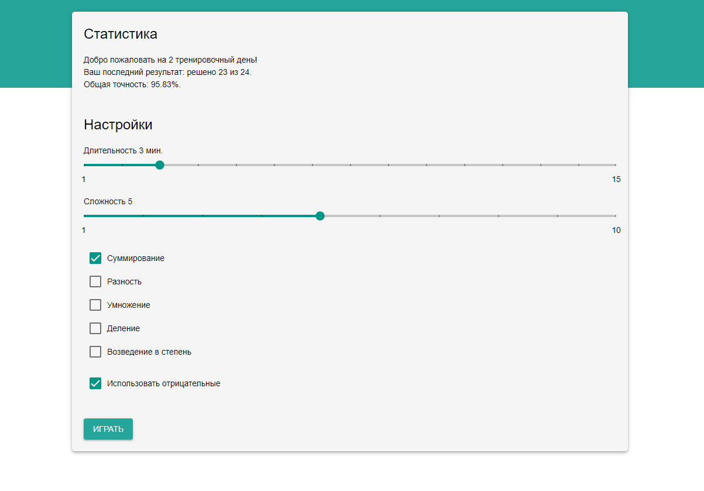
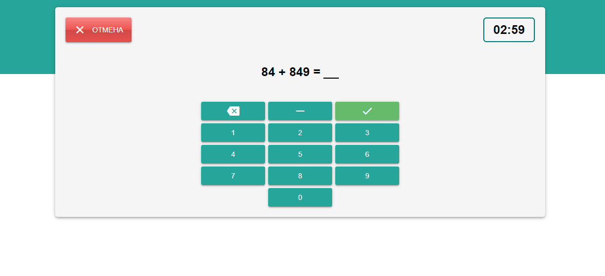

# OTUS Verbal Counting

OTUS Verbal Counting is a single page application for practicing verbal counting.
OTUS Verbal Counting allows you to set parameters such as the duration and difficulty of the game, as well as select the desired mathematical operations.
OTUS Verbal Counting generates random tasks depending on the settings you choose, and you have to solve the most number of them in the given time. In addition, OTUS Verbal Counting will save your game score so you can track your progress in verbal counting.

  

  

